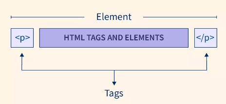
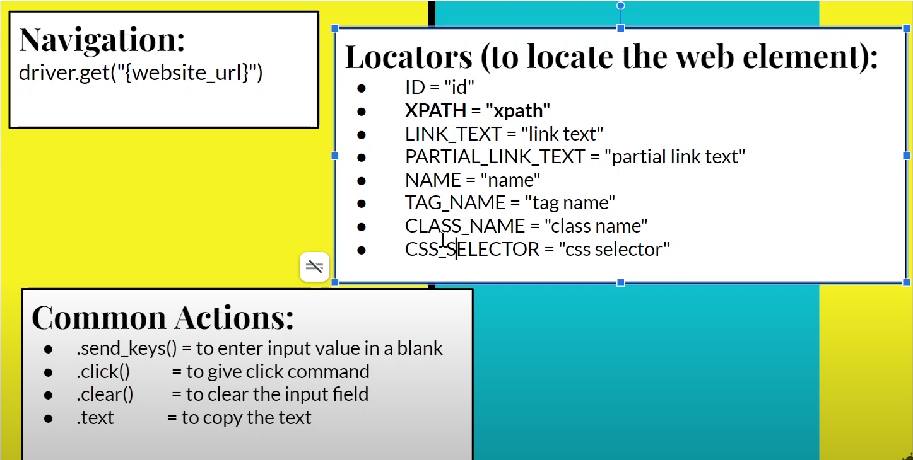
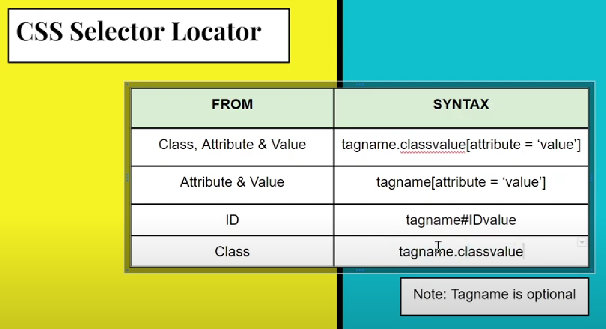
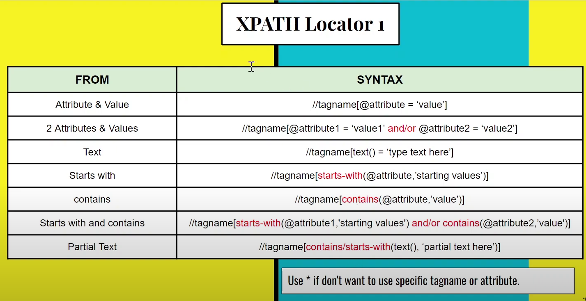
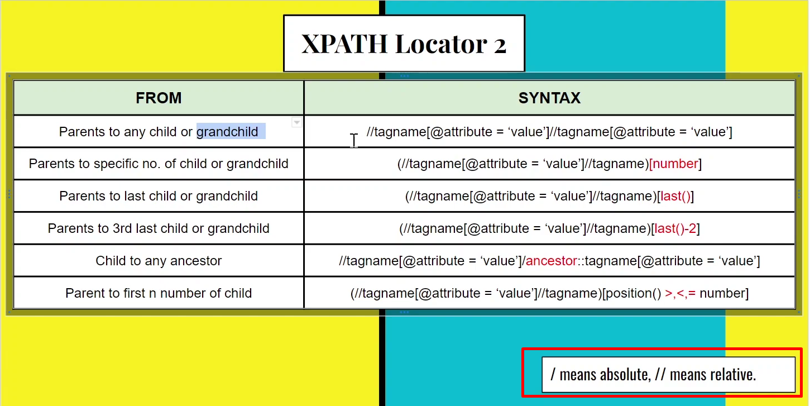
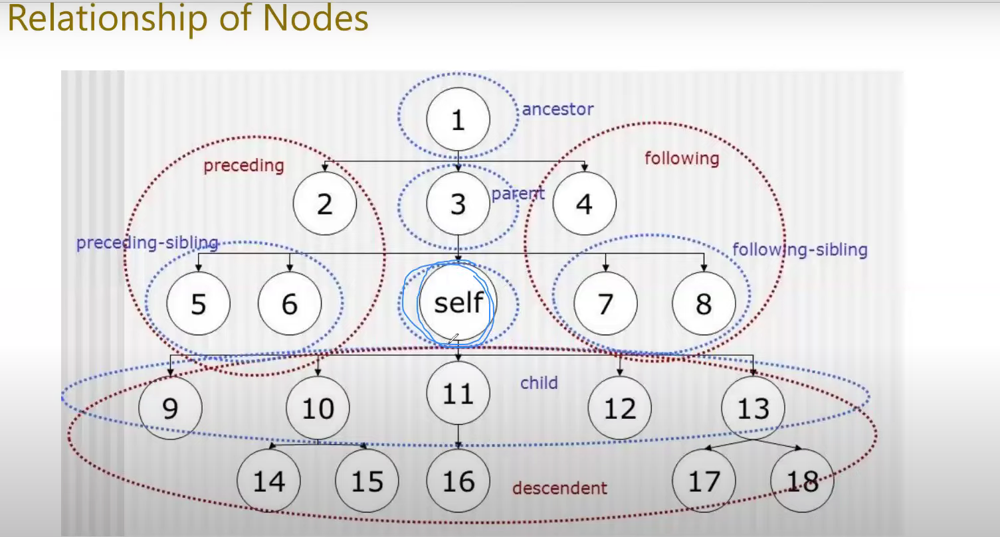
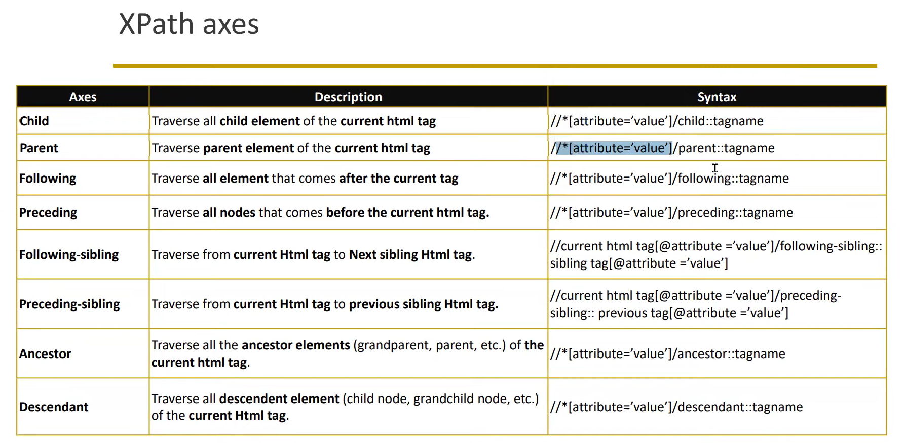
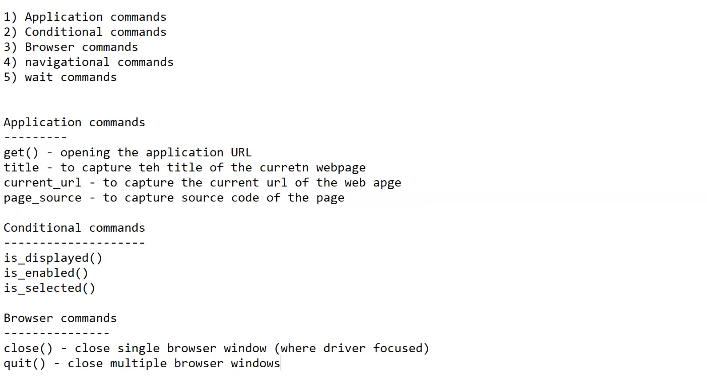

# Selenium Tutorial

1. Install Selenium
    `pip install selenum`
2. Install Python
3. Install webdrivers if selenium version is order than 4.6

## Write First test
- Open google.com in chrome
    ```
    from selenium import webdriver
    driver = webdriver.Chrome()
    driver.get(www.google.com)
    ```
  Above code open will open the google.com in chrome browser and then instantly browser will get close


- To disable the auto close of browser add below code

    ```
    from selenium.webdriver.chrome.options import Options
    options = Options()
    options.add_experimental_option("detach", True)
    driver = webdriver.Chrome(options=options)
    ```
    Complete code:
    ```
    from selenium import webdriver
    from selenium.webdriver.chrome.options import Options
    options = Options()
    options.add_experimental_option("detach", True)
    driver = webdriver.Chrome(options=options)
    driver.get(www.google.com)

    ```
    Now the browser will not get close after opening google.com or any website
    
# Web Elements
- In HTML, an element is a section of an HTML document. Elements can represent visible components on a web page, such as text, images, or buttons. They can also denote different sections of the page or provide meta-information about the document.
- Everything on HTML page is an element, like: text, image, input, radiobutton, chechbox, button, dropdown, link, etc..
- Every element have their unique identity like: id, name, class, value, type, tag, etc...

    

## Navigate or Locate Web Elements
- There are two classes in selenium to locate web elements: `find_element()` and `find_elements()`


    
# Find Elements
- Finding the CheckBox elements first need html code of that element
- To find element code over cursor over the element then right click and then click on `inspect`


- Below is the code of CheckBox1 code


```
  # Find the checkbox element by ID and click
  driver.find_element(By.ID, 'checkBoxOption1').click()
  driver.find_element(By.ID, 'checkBoxOption2').click()
  checkbox3 = driver.find_element(By.ID, 'checkBoxOption3')
  checkbox3.click()
  
  # Find Checkbox Elements by Name and Click
  driver.find_element(By.NAME, 'checkBoxOption1').click()
  driver.find_element(By.NAME, 'checkBoxOption2').click()
  driver.find_element(By.NAME, 'checkBoxOption3').click()
  
  # Find elements by ClassName, all the elements name,id,class should be unique to perform action
  driver.find_element(By.CLASS_NAME,'radioButton').click()
```
LINK TEXT
- Complete text of a link which showing on page


```
driver.find_element(By.LINK_TEXT,"Free Access to InterviewQues/ResumeAssistance/Material").click()
```

PARTIAL_LINK TEXT
- Partial text of link showing on page
```
driver.find_element(By.PARTIAL_LINK_TEXT,"Free Access to InterviewQues").click()
```
     - LINK TEXT- "Free Access to InterviewQues/ResumeAssistance/Material"
     - Partial Link Text - "Free Access to InterviewQues"

## CSS Selector
- If unique locator of element not found using id,name,class then CSS_SELECTOR helps to achieve that


#### Where to use CSS-Selector
- Where there is no unique id,name or class present, like as below
  there are three radio buttons with same name,class attributes and there is no id attributes in all three radio buttons,
  so here we can use CSS-Selector to identify the unique key
    

  ### Let use Class css first
  - To use class, class attribute must be present in that element
  - Using Class and tag name we found 3 result it should be one result for unique id, so we cant use this css class
  - in CSS `.` use to define class and `#` use to define ID
  - to use css class write `TagName.ClassName`, i.e: `input.radioButton` or `.radioButton` tagname is optional
  


### Let use ID
  - to use ID, it must be present
  - `TagName#IDValue` or `.#IdValue` i.e.: `input#radio1` or `#radio1`
  - as there is no id in the radiobutton element, so we cant use this

# XPATH Locator
https://www.youtube.com/watch?v=GgxGxDwFDzI&list=PLuGEX9IcSH_fpjGwozBc2Cpc7LOSMUhSq&index=5



  1. Attribute and value
     - syntax: `//tagname[@attribute = 'value']`
     - i.e.: `//input[@value='radio1']`
     - Code: `driver.find_element(By.XPATH, "//input[@value='radio1']").click()`
  2. Using 2 or more attributes and value of same element
       - syntax : `//tagname[@atribute1 = 'value' and/or @attribute2 = 'value']`
       - i.e.: `//input[@value = 'radio1' and @class = 'radioButton']`
       - i.e.: `//input[@value = 'radio1' or @class = 'radioButton']`
       - Code1: `driver.find_element(By.XPATH, "//input[@value='radio1' and @class = 'radioButton']").click()`
    







